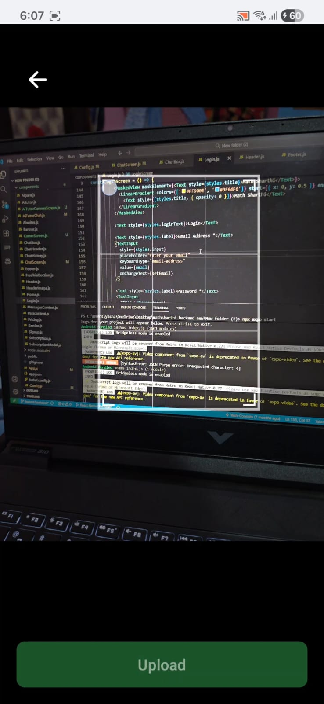
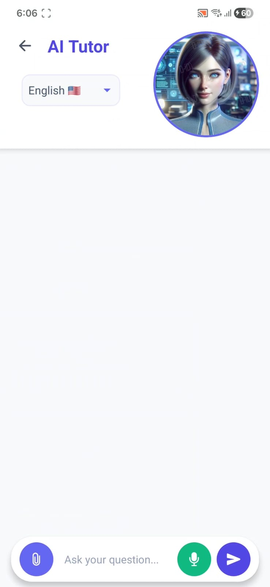
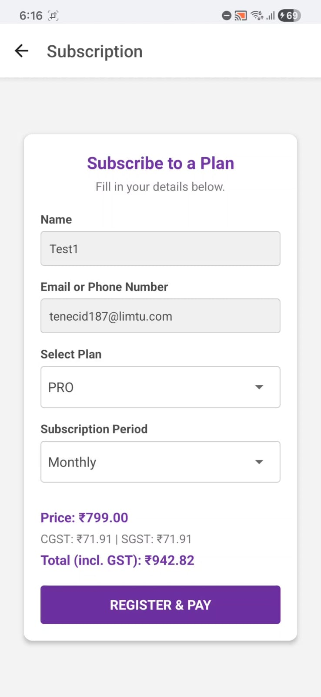
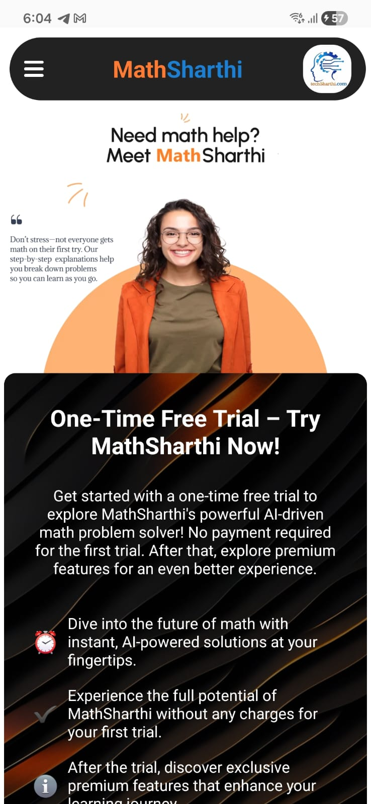
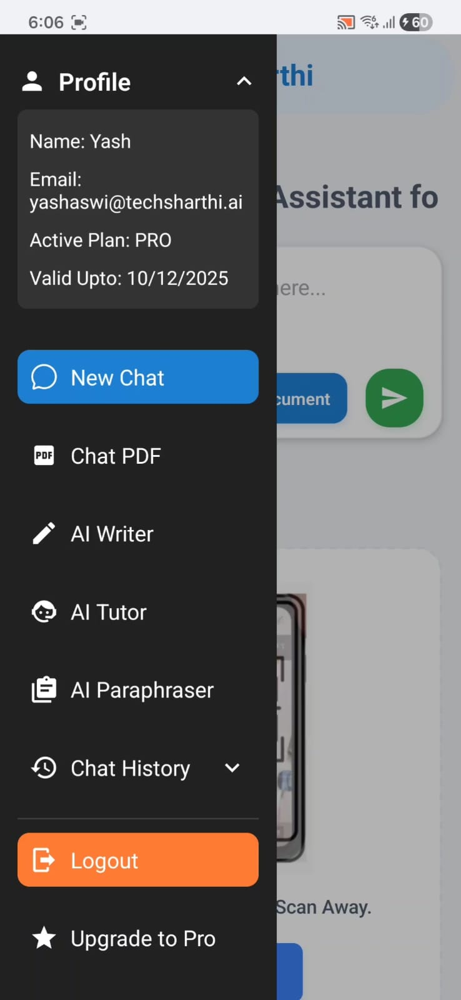

<p align="center">
  
</p>

<h1 align="center">MathSharthi — Mobile Frontend Case Study</h1>

<p align="center">
  <strong>AI-powered math tutoring app · React Native · Expo SDK 52</strong>
</p>

<p align="center">
  
  
  
  
  
</p>

---

## 📌 Project Snapshot

| | |
|---|---|
| **Duration** | 1 month |
| **Role** | Sole mobile frontend developer |
| **Screens** | 12+ |
| **APIs Integrated** | 5+ capability groups |
| **Platform** | React Native / Expo (Android & iOS) |
| **Backend** | Provided by separate backend team |
| **Design Source** | Self-designed from web reference (no Figma handoff) |
| **Build Type** | Internal demo (EAS dev builds) |

---

## 📑 Table of Contents

- [Project Snapshot](#-project-snapshot)
- [Demo](#-demo)
- [Project Overview](#-project-overview)
- [Responsibilities & Ownership](#-responsibilities--ownership)
- [Technical Stack](#-technical-stack)
- [Architecture Summary](#-architecture-summary)
- [Architecture Preview](#-architecture-preview)
- [Key Engineering Challenges](#-key-engineering-challenges)
- [Performance Optimizations](#-performance-optimizations)
- [Engineering Skills Demonstrated](#-engineering-skills-demonstrated)
- [Impact & Outcomes](#-impact--outcomes)
- [Screenshots](#-screenshots)
- [Repository Structure](#-repository-structure)
- [Disclaimer](#%EF%B8%8F-disclaimer)

---

## 🎬 Demo

### Screenshots

> App screenshots stored in [`/screenshots`](./screenshots/).

| | | |
|---|---|---|
|  |  |  |
| AI Chat Interface | Camera Capture & Crop | AI Tutor (Voice) |
|  |  |  |
| Subscription Plans | Landing Page | Animated Drawer |

### Video Walkthrough

<!-- Replace the placeholder below with your actual YouTube video link -->
<!-- [](https://www.youtube.com/watch?v=VIDEO_ID) -->

> 🎥 *Video walkthrough coming soon — will demonstrate the AI chat, camera capture, voice tutor, and payment flows.*

---

## 📋 Project Overview

MathSharthi is an AI-powered mobile application that helps students solve math problems through text, camera capture, file uploads, and voice interaction. Built during my internship as the **sole frontend developer**, the app delivers a production-grade mobile experience across **16 screens** and **7 feature modules**.

**Key context:**
- No UI/UX designs were provided — all interfaces were **self-designed** using the web version as a visual reference
- Backend REST APIs were provided by the backend team; I owned the entire mobile client
- Built as an **internal demo** using EAS development builds (not a public App Store release)

---

## 👤 Responsibilities & Ownership

**Role:** Sole Mobile Frontend Developer

| Area | Scope |
|---|---|
| **UI Design & Implementation** | Self-designed all 16 screens from web reference — no Figma/design handoff |
| **AI Chat Interface** | Real-time messaging with typing indicators, Markdown rendering, mixed-content bubbles (text, images, PDFs) |
| **Camera Pipeline** | Capture → interactive crop → aspect-ratio-aware resize → compress → multipart upload |
| **AI Tutor with Voice** | Audio recording (WAV, 16kHz), server-side transcription, Google Cloud TTS playback, bilingual support (EN/HI) |
| **AI Writer & Paraphraser** | Two-screen input → result flows with Markdown output and clipboard copy |
| **Payment Integration** | Razorpay SDK checkout with dynamic pricing, GST calculation, payment verification, invoice download |
| **Authentication** | Login, registration, OTP verification, forgot-password recovery, session management |
| **Navigation Architecture** | Stack navigator with custom animated drawer headers, conditional session gating |
| **Platform Handling** | Android/iOS branching for file URIs, camera permissions, keyboard behavior, audio codec configs |

---

## 🛠 Technical Stack

| Layer | Technologies |
|---|---|
| **Framework** | React Native 0.76 · Expo SDK 52 · EAS Dev Builds |
| **Navigation** | React Navigation (Stack) · Custom animated drawers |
| **State** | React Context API · AsyncStorage (persistent sessions) |
| **Networking** | Axios (multipart uploads) · Fetch API |
| **Camera & Media** | Vision Camera · Image Crop Tools · Expo Image Manipulator · Document Picker |
| **Audio** | Expo AV (WAV recording + MP3 playback) |
| **Payments** | Razorpay React Native SDK |
| **UI** | React Native Paper · Vector Icons · Linear Gradient · Masked View · Markdown Display |
| **Tooling** | Yarn · Metro Bundler · Babel |

**39 total dependencies** managed via Yarn with locked versions.

---

## 🏗 Architecture Summary

```
App.js (Session Gate)
│
├── Stack.Navigator (16 screens, all custom headers)
│   ├── Landing Module ─── Home · Banner · Service Carousel · Pricing · About · Footer
│   ├── Auth Module ────── Login (+ forgot-password modals) · Signup (+ OTP modal)
│   ├── AI Chat Module ─── ChatScreen · ChatBox · CameraScreen · ChatHistory
│   ├── AI Tutor Module ── TutorWelcome · TutorChat (voice I/O) · TutorCamera
│   ├── AI Tools Module ── Writer Input/Output · Paraphraser Input/Output
│   └── Payments Module ── Subscription Form · Plan Comparison Modal
│
├── MessagesContext (React Context — cross-component chat state)
└── AsyncStorage (auth tokens, user profile, session timestamp)
```

**Key architectural decisions:**
- **Context API over Redux** — single shared resource (messages); avoided boilerplate for small state surface
- **Server-side TTS/STT over on-device** — abandoned `react-native-tts`/`react-native-voice` due to cross-device inconsistencies; server-side Google Cloud TTS provided uniform voice quality
- **Custom headers everywhere** — disabled React Navigation's default header to enable fully animated drawer + profile dropdown UX
- **Image preprocessing before upload** — standardized all captures to 800px JPEG @ 70% quality

---

## 🗺 Architecture Preview

> Detailed diagrams are in [`/diagrams`](./diagrams/) and [`/architecture`](./architecture/).

| Diagram | Description | Link |
|---|---|---|
| **System Overview** | Mobile client → API groups → external services | [View →](./diagrams/system-overview.md) |
| **Camera Upload Flow** | Capture → crop → compress → upload → cleanup | [View →](./diagrams/camera-flow.md) |
| **Audio Tutor Loop** | STT recording → transcription → AI → TTS playback | [View →](./diagrams/audio-loop.md) |
| **Navigation Architecture** | Screen hierarchy, session gating, param passing | [View →](./architecture/navigation.md) |
| **Camera Pipeline Detail** | 7-stage pipeline with error handling | [View →](./architecture/camera-upload-pipeline.md) |
| **Audio Pipeline Detail** | TTS/STT architecture, device issues, stabilization | [View →](./architecture/audio-pipeline.md) |

---

## ⚡ Key Engineering Challenges

### 🎤 Audio Pipeline Stabilization
Iterated through **4 architecture versions** of the AI Tutor component to resolve cross-device audio issues. Migrated from on-device speech engines to server-side processing after discovering inconsistent behavior across Samsung, OnePlus, and Xiaomi devices. Final pipeline: WAV recording (platform-specific codec configs) → server transcription → Google Cloud TTS response (base64 MP3) → cached playback with automatic cleanup.

### 📷 Cross-Platform Camera Integration
Integrated `react-native-vision-camera` (native module requiring EAS builds, not Expo Go). Resolved Android/iOS URI format discrepancy (`file://` prefix requirement) and built a multi-step async chain: capture → platform URI conversion → interactive crop → aspect-ratio-aware resize → compress → upload → state update → navigation.

### 💳 End-to-End Payment Flow
Integrated Razorpay's native SDK with a multi-step async workflow: fetch plans → compute dynamic pricing with GST → create server-side order → launch checkout modal → verify payment signature → download PDF invoice via file system → open in native viewer.

### 🎨 UI Without Design Handoff
Built all 16 screens without Figma files or design specifications. Derived layouts from the existing web version, adapted them for mobile viewpoints, and added mobile-specific UX patterns (animated drawers, floating action buttons, typing indicators, gesture handling).

### 🔄 Conversation Memory Management
Implemented contextual follow-up queries in the AI Tutor by maintaining file data/metadata state across messages, enabling users to ask successive questions about the same uploaded document without re-uploading.

---

## 🚀 Performance Optimizations

| Optimization | Impact |
|---|---|
| Image resize + compress (800px, JPEG 70%) before upload | ~60–80% payload reduction |
| `React.memo` on `MessageItem` components | Prevents unnecessary re-renders during chat scroll |
| `FlatList` with `inverted` mode + `initialNumToRender` | Virtualized chat with efficient new-message insertion |
| Temp file cleanup after every upload cycle | Prevents device storage bloat |
| Audio cache deletion on playback completion | Immediate cleanup of TTS audio files |
| Conditional payload format (FormData only when files present) | Reduced overhead for text-only queries |
| Cloudinary WebP assets for landing page | Optimized image delivery via CDN |
| Message cap (100) in AI Tutor | Bounded memory usage in long sessions |

---

## 🧰 Engineering Skills Demonstrated

| Skill Area | Application in Project |
|---|---|
| **Mobile Architecture Design** | Designed full navigation hierarchy, session gating, and modular screen organization for 16 screens across 7 feature modules |
| **Media Pipeline Implementation** | Built camera capture → crop → resize → compress → upload chain with platform-specific handling and graceful error recovery |
| **Async State Orchestration** | Managed concurrent async workflows (file uploads, API calls, audio recording/playback) with optimistic UI updates and temporary message placeholders |
| **API Integration** | Integrated 5+ backend API groups using both Axios (multipart) and Fetch (JSON), with auth header injection and error handling |
| **Performance Optimization** | Implemented image compression (60–80% reduction), virtualized lists, `React.memo`, temp file cleanup, and bounded message arrays |
| **Payment SDK Integration** | End-to-end Razorpay flow: order creation → native checkout → server verification → invoice download via file system |
| **UX Animation Engineering** | Built animated drawers (Animated.timing + translateX), typing indicators (bouncing dots), carousel with infinite loop, and breathing button effects |

---

## 📊 Impact & Outcomes

- Delivered **16 functional screens** across 7 feature modules as sole frontend developer
- Integrated **10 backend API capability groups** (16 distinct endpoints) into a cohesive mobile experience
- Built **complete payment flow** from plan selection through invoice download
- Implemented **multimodal AI interaction** — text, camera, file upload, and voice I/O
- Resolved **cross-device audio issues** through 4 architecture iterations, arriving at a stable server-side TTS/STT solution
- Self-designed all UI/UX without design handoff, adapting web layouts for mobile

---

## 📸 Screenshots

> Screenshots are stored in the [`/screenshots`](./screenshots/) directory.

| Screen | Preview |
|---|---|
| AI Chat Interface |  |
| Camera Capture & Crop |  |
| AI Tutor (Voice Mode) |  |
| Subscription Plans |  |
| Landing Page |  |
| Animated Drawer |  |

---

## 📁 Repository Structure

```
mathsharthi-app-case-study/
├── README.md
├── screenshots/
│   ├── chat.png
│   ├── camera.png
│   ├── tutor.png
│   ├── plans.png
│   ├── landing.png
│   └── drawer.png
├── architecture/
│   ├── navigation.md
│   ├── camera-upload-pipeline.md
│   └── audio-pipeline.md
├── diagrams/
│   ├── system-overview.md
│   ├── camera-flow.md
│   └── audio-loop.md
├── challenges/
│   ├── audio-stabilization.md
│   ├── camera-pipeline.md
│   └── payment-integration.md
└── snippets/
    ├── animated-drawer.js
    ├── image-resize.js
    └── session-gate.js
```

> **Note:** The `snippets/` directory contains **rewritten, genericized patterns** inspired by my implementation — not copied source code.

---

## ⚠️ Disclaimer

This repository is a **case study and portfolio showcase**. It does **not** contain proprietary source code from the MathSharthi project.

**Excluded from this repository:**
- Original component source files
- API endpoints, keys, or authentication secrets
- Backend response schemas or business logic
- Pricing algorithms or subscription tier configurations
- AI prompts or model interaction logic
- Company branding assets (logos, icons, mascots)
- Cloudinary asset URLs

All code snippets in this repository are **rewritten from scratch** to demonstrate patterns and techniques — they are not direct copies of the production codebase.

---

<p align="center">
  <sub>Built with ❤️ · 2025</sub>
</p>
