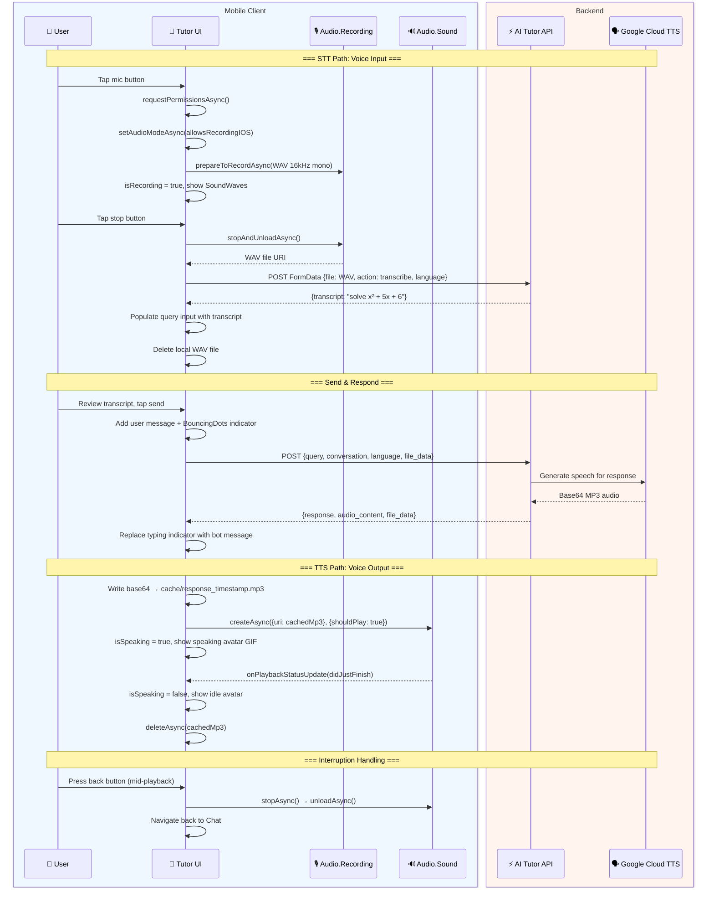

# Audio Tutor Loop

```mermaid
sequenceDiagram
    box rgb(240, 248, 255) Mobile Client
        participant U as 👤 User
        participant UI as 📱 Tutor UI
        participant Rec as 🎙️ Audio.Recording
        participant Play as 🔊 Audio.Sound
    end

    box rgb(255, 245, 238) Backend
        participant API as ⚡ AI Tutor API
        participant TTS as 🗣️ Google Cloud TTS
    end

    Note over U,TTS: === STT Path: Voice Input ===

    U->>UI: Tap mic button
    UI->>UI: requestPermissionsAsync()
    UI->>UI: setAudioModeAsync(allowsRecordingIOS)
    UI->>Rec: prepareToRecordAsync(WAV 16kHz mono)
    UI->>UI: isRecording = true, show SoundWaves

    U->>UI: Tap stop button
    UI->>Rec: stopAndUnloadAsync()
    Rec-->>UI: WAV file URI

    UI->>API: POST FormData {file: WAV, action: transcribe, language}
    API-->>UI: {transcript: "solve x² + 5x + 6"}

    UI->>UI: Populate query input with transcript
    UI->>UI: Delete local WAV file

    Note over U,TTS: === Send & Respond ===

    U->>UI: Review transcript, tap send
    UI->>UI: Add user message + BouncingDots indicator

    UI->>API: POST {query, conversation, language, file_data}
    API->>TTS: Generate speech for response
    TTS-->>API: Base64 MP3 audio
    API-->>UI: {response, audio_content, file_data}

    UI->>UI: Replace typing indicator with bot message

    Note over U,TTS: === TTS Path: Voice Output ===

    UI->>UI: Write base64 → cache/response_timestamp.mp3
    UI->>Play: createAsync({uri: cachedMp3}, {shouldPlay: true})
    UI->>UI: isSpeaking = true, show speaking avatar GIF

    Play-->>UI: onPlaybackStatusUpdate(didJustFinish)
    UI->>UI: isSpeaking = false, show idle avatar
    UI->>UI: deleteAsync(cachedMp3)

    Note over U,TTS: === Interruption Handling ===

    U->>UI: Press back button (mid-playback)
    UI->>Play: stopAsync() → unloadAsync()
    UI->>UI: Navigate back to Chat
```
