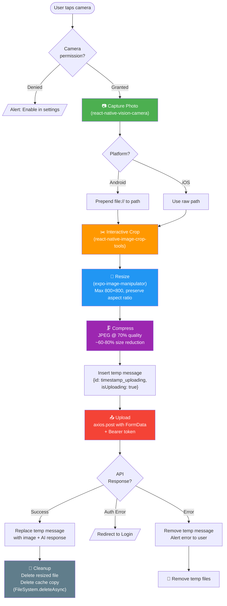

# Camera Upload Flow

```mermaid
flowchart TD
    Start([User taps camera]) --> Perm{Camera\npermission?}
    Perm -->|Denied| Alert1[/"Alert: Enable in settings"/]
    Perm -->|Granted| Capture["📷 Capture Photo\n(react-native-vision-camera)"]

    Capture --> Platform{Platform?}
    Platform -->|Android| Prefix["Prepend file:// to path"]
    Platform -->|iOS| Raw["Use raw path"]
    Prefix --> Crop
    Raw --> Crop

    Crop["✂️ Interactive Crop\n(react-native-image-crop-tools)"] --> Resize

    Resize["📐 Resize\n(expo-image-manipulator)\nMax 800×800, preserve aspect ratio"] --> Compress

    Compress["🗜️ Compress\nJPEG @ 70% quality\n~60-80% size reduction"] --> TempMsg

    TempMsg["Insert temp message\n{id: timestamp_uploading,\nisUploading: true}"] --> Upload

    Upload["📤 Upload\naxios.post with FormData\n+ Bearer token"] --> Response{API\nResponse?}

    Response -->|Success| Update["Replace temp message\nwith image + AI response"]
    Response -->|Auth Error| Login[/"Redirect to Login"/]
    Response -->|Error| Remove["Remove temp message\nAlert error to user"]

    Update --> Cleanup["🧹 Cleanup\nDelete resized file\nDelete cache copy\n(FileSystem.deleteAsync)"]

    Remove --> Cleanup2["🧹 Remove temp files"]

    style Capture fill:#4CAF50,color:#fff
    style Crop fill:#FF9800,color:#fff
    style Resize fill:#2196F3,color:#fff
    style Compress fill:#9C27B0,color:#fff
    style Upload fill:#F44336,color:#fff
    style Cleanup fill:#607D8B,color:#fff
```
