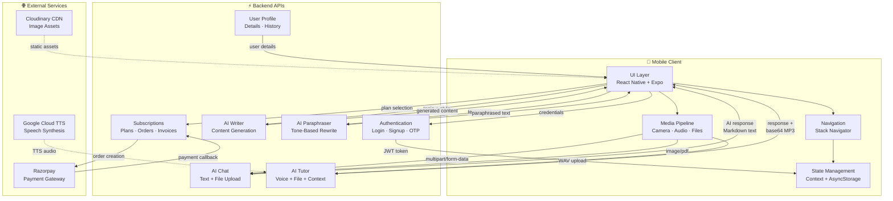

# System Overview

```mermaid
graph TB
    subgraph Mobile["📱 Mobile Client"]
        UI["UI Layer<br/>React Native + Expo"]
        Nav["Navigation<br/>Stack Navigator"]
        State["State Management<br/>Context + AsyncStorage"]
        Media["Media Pipeline<br/>Camera · Audio · Files"]
    end

    subgraph APIs["⚡ Backend APIs"]
        Auth["Authentication<br/>Login · Signup · OTP"]
        Chat["AI Chat<br/>Text + File Upload"]
        Tutor["AI Tutor<br/>Voice + File + Context"]
        Writer["AI Writer<br/>Content Generation"]
        Para["AI Paraphraser<br/>Tone-Based Rewrite"]
        Subs["Subscriptions<br/>Plans · Orders · Invoices"]
        Profile["User Profile<br/>Details · History"]
    end

    subgraph External["🌐 External Services"]
        Razorpay["Razorpay<br/>Payment Gateway"]
        GCP["Google Cloud TTS<br/>Speech Synthesis"]
        CDN["Cloudinary CDN<br/>Image Assets"]
    end

    UI --> Nav
    Nav --> State
    UI --> Media

    Media -->|"multipart/form-data"| Chat
    Media -->|"WAV upload"| Tutor
    Media -->|"image/pdf"| Chat

    UI -->|"credentials"| Auth
    Auth -->|"JWT token"| State

    UI -->|"topic + style"| Writer
    UI -->|"text + tone"| Para

    UI -->|"plan selection"| Subs
    Subs -->|"order creation"| Razorpay
    Razorpay -->|"payment callback"| Subs

    Chat -->|"AI response<br/>Markdown text"| UI
    Tutor -->|"response +<br/>base64 MP3"| UI
    Writer -->|"generated content"| UI
    Para -->|"paraphrased text"| UI

    GCP -.->|"TTS audio"| Tutor
    CDN -.->|"static assets"| UI
    Profile -->|"user details"| UI
```
